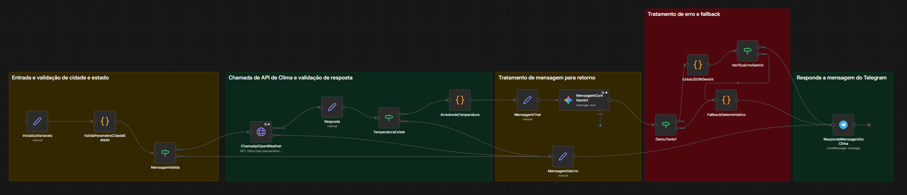

# BotClima - Chatbot de Clima para Telegram

Um chatbot inteligente para Telegram que fornece informações sobre o clima de cidades brasileiras. O bot utiliza a API do OpenWeather para obter dados meteorológicos e o Google Gemini para gerar mensagens mais naturais e amigáveis.

## Descrição

O **BotClima** é um workflow automatizado desenvolvido em n8n que:

- Recebe mensagens do Telegram com o formato `Cidade,UF` (ex: `São Paulo,SP`)
- Valida os parâmetros de entrada (cidade e estado brasileiro)
- Consulta a API do OpenWeather para obter dados meteorológicos
- Processa e arredonda a temperatura
- Utiliza o Google Gemini para reescrever a mensagem de forma mais natural
- Envia a resposta formatada de volta ao usuário via Telegram
- Implementa tratamento de erros robusto com fallback determinístico

### Funcionalidades

✅ Validação de entrada de cidade e estado brasileiro  
✅ Integração com API OpenWeather  
✅ Processamento inteligente de mensagens com Google Gemini  
✅ Tratamento de erros com fallback automático  
✅ Mensagens amigáveis e em português brasileiro  

## Workflow

O workflow está organizado em 5 seções principais:

1. **Entrada e validação de cidade e estado** - Valida o formato da entrada
2. **Chamada de API de Clima e validação de resposta** - Consulta o OpenWeather
3. **Tratamento de mensagem para retorno** - Processa e formata a mensagem
4. **Tratamento de erro e fallback** - Gerencia erros e fornece fallback
5. **Responde a mensagem do Telegram** - Envia a resposta final



## Estrutura do Projeto

```
desafio-fase-2/
├── workflow-chatbot-telegram.json    # Arquivo do workflow n8n
├── screenshot/
│   └── imagem-workflow-bot.png      # Diagrama visual do workflow
└── README.md                         # Este arquivo
```

## Como Importar o Workflow

### Pré-requisitos

- Ter o n8n instalado e rodando
- Acesso ao n8n via interface web

### Passo a Passo

1. **Acesse o n8n**
   - Abra o n8n no seu navegador (geralmente em `http://localhost:5678`)

2. **Importe o workflow**
   - Clique no menu **"Workflows"** no topo
   - Clique no botão **"Import from File"** ou **"Import from URL"**
   - Selecione o arquivo `workflow-chatbot-telegram.json` deste repositório
   - O workflow será importado com o nome **"BotClima"**

3. **Configure as credenciais** (veja seção abaixo)

4. **Ative o workflow**
   - Certifique-se de que o workflow está **ativo** (toggle no canto superior direito)
   - O workflow será executado automaticamente quando receber mensagens do Telegram

## 🔑 Configuração de Credenciais

O workflow requer três credenciais principais. Siga as instruções abaixo para configurá-las:

### 1. Telegram Bot Token (`TELEGRAM_BOT_TOKEN`)

1. **Crie um bot no Telegram:**
   - Abra o Telegram e procure por [@BotFather](https://t.me/botfather)
   - Envie o comando `/newbot`
   - Siga as instruções para criar seu bot
   - Copie o **token** fornecido pelo BotFather (formato: `123456789:ABCdefGHIjklMNOpqrsTUVwxyz`)

2. **Configure no n8n:**
   - No workflow, localize o nó **"RespondeMensagemDoClima"**
   - Clique no nó e vá em **"Credentials"**
   - Selecione ou crie uma credencial do tipo **"Telegram API"**
   - Cole o token do bot no campo apropriado
   - Salve a credencial com o nome: **`TELEGRAM_BOT_TOKEN`**

3. **Configure o webhook (opcional):**
   - O n8n pode configurar o webhook automaticamente
   - Ou você pode configurar manualmente usando a API do Telegram

### 2. OpenWeather API Key (`OPENWEATHER_API_KEY`)

1. **Obtenha uma chave de API:**
   - Acesse [OpenWeatherMap](https://openweathermap.org/api)
   - Crie uma conta gratuita
   - Acesse a seção **"API keys"** no seu perfil
   - Gere uma nova chave de API
   - Copie a chave (formato: `abcdef1234567890abcdef1234567890`)

2. **Configure no n8n:**
   - No workflow, localize o nó **"ChamaApiOpenWeather"**
   - O workflow usa variável de ambiente
   - Configure a variável de ambiente no n8n:
     - Vá em **Settings** → **Environment Variables**
     - Adicione: `OPENWEATHER_API_KEY` = `sua_chave_aqui`
   - Ou configure diretamente no nó usando `={{$env.OPENWEATHER_API_KEY}}`

### 3. Google Gemini API Key (`GEMINI_KEY_API`)

1. **Obtenha uma chave de API:**
   - Acesse [Google AI Studio](https://makersuite.google.com/app/apikey) ou [Google Cloud Console](https://console.cloud.google.com/)
   - Crie um projeto ou selecione um existente
   - Ative a API do Gemini
   - Gere uma nova chave de API
   - Copie a chave

2. **Configure no n8n:**
   - No workflow, localize o nó **"MensagemComGemini"**
   - Clique no nó e vá em **"Credentials"**
   - Selecione ou crie uma credencial do tipo **"Google Gemini API"**
   - Cole a chave de API no campo apropriado
   - Salve a credencial com o nome: **`GEMINI_KEY_API`**

## Variáveis de Ambiente Esperadas

O workflow utiliza as seguintes variáveis de ambiente e credenciais:

| Variável/Credencial | Tipo | Onde é Usada | Descrição |
|---------------------|------|--------------|-----------|
| `OPENWEATHER_API_KEY` | Variável de Ambiente | Nó `ChamaApiOpenWeather` | Chave de API do OpenWeather para consultar dados meteorológicos |
| `TELEGRAM_BOT_TOKEN` | Credencial n8n | Nó `RespondeMensagemDoClima` | Token do bot do Telegram para enviar mensagens |
| `GEMINI_KEY_API` | Credencial n8n | Nó `MensagemComGemini` | Chave de API do Google Gemini para processar mensagens |

### Nota sobre Fallback

O workflow possui um sistema de **fallback determinístico** que permite funcionar mesmo sem a credencial do Gemini. Se o Gemini falhar ou não estiver configurado, o bot enviará uma mensagem formatada diretamente, sem o processamento de IA.

## Como Usar

1. **Inicie uma conversa com o bot no Telegram**
   - Procure pelo seu bot no Telegram usando o username fornecido pelo BotFather

2. **Envie uma mensagem no formato:**
   ```
   Cidade,UF
   ```
   Exemplos:
   - `São Paulo,SP`
   - `Rio de Janeiro,RJ`
   - `Belo Horizonte,MG`
   - `Curitiba,PR`

3. **Aguarde a resposta:**
   - O bot processará a solicitação e retornará a temperatura atual da cidade informada
   - A mensagem será formatada de forma amigável e natural

## Troubleshooting

### Bot não responde
- Verifique se o workflow está ativo no n8n
- Confirme que o webhook do Telegram está configurado corretamente
- Verifique os logs de execução no n8n

### Erro ao consultar clima
- Verifique se a chave `OPENWEATHER_API_KEY` está configurada corretamente
- Confirme que o formato da mensagem está correto (`Cidade,UF`)
- Verifique se a cidade existe e está no formato correto

### Erro no Gemini
- O workflow possui fallback automático, então continuará funcionando
- Verifique se a credencial `GEMINI_KEY_API` está configurada
- Se não tiver Gemini, o bot funcionará normalmente com mensagem determinística

## Licença

Este projeto é um exemplo educacional de automação com n8n.
